# AI-DLC Agile Adaptive Workflow Overview

**Purpose**: Technical reference for AI model and developers to understand complete workflow structure.

**Note**: This is the Agile variant of AI-DLC, extending the base workflow with Vision Stage, Epic Stage, Product Backlog management, and optional Jira MCP integration.

## The Three-Phase Lifecycle:
- **INCEPTION PHASE**: Planning and architecture (Workspace Detection + Vision + conditional phases + Epic + Workflow Planning + Backlog Init)
- **CONSTRUCTION PHASE**: Design, implementation, build and test (per-unit design + Code Planning/Generation + Build & Test)
- **OPERATIONS PHASE**: Placeholder for future deployment and monitoring workflows

## The Agile-Extended Workflow:
- **Workspace Detection** (always) -> **Vision Stage** (conditional) -> **Reverse Engineering** (brownfield only) -> **Requirements Analysis** (always) -> **User Stories** (conditional) -> **Epic Stage** (conditional) -> **Workflow Planning** (always, includes Backlog Init) -> **Code Generation** (always, per-unit) -> **Build and Test** (always)

## How It Works:
- **AI analyzes** your request, workspace, and complexity to determine which stages are needed
- **These stages always execute**: Workspace Detection, Requirements Analysis (adaptive depth), Workflow Planning (with Backlog Init), Code Generation (per-unit), Build and Test
- **Conditional stages**: Vision Stage, Reverse Engineering, User Stories, Epic Stage, Application Design, Units Generation, per-unit design stages
- **Living artifacts**: Product Backlog updated at every approval gate
- **Optional integration**: Jira MCP sync if available

## Your Team's Role:
- **Answer questions** in dedicated question files using [Answer]: tags with letter choices (A, B, C, D, E)
- **Option E available**: Choose "Other" and describe your custom response if provided options don't match
- **Work as a team** to review and approve each phase before proceeding
- **Collectively decide** on architectural approach when needed
- **Important**: This is a team effort - involve relevant stakeholders for each phase

## AI-DLC Agile Three-Phase Workflow:

```mermaid
flowchart TD
    Start(["User Request"])

    subgraph INCEPTION["🔵 INCEPTION PHASE"]
        WD["Workspace Detection<br/><b>ALWAYS</b>"]
        VS["Vision Stage<br/><b>CONDITIONAL</b>"]
        RE["Reverse Engineering<br/><b>CONDITIONAL</b>"]
        RA["Requirements Analysis<br/><b>ALWAYS</b>"]
        Stories["User Stories<br/><b>CONDITIONAL</b>"]
        ES["Epic Stage<br/><b>CONDITIONAL</b>"]
        WP["Workflow Planning<br/><b>ALWAYS</b>"]
        BL["Backlog Init<br/><b>LIVING</b>"]
        AppDesign["Application Design<br/><b>CONDITIONAL</b>"]
        UnitsG["Units Generation<br/><b>CONDITIONAL</b>"]
    end

    subgraph CONSTRUCTION["🟢 CONSTRUCTION PHASE"]
        FD["Functional Design<br/><b>CONDITIONAL</b>"]
        NFRA["NFR Requirements<br/><b>CONDITIONAL</b>"]
        NFRD["NFR Design<br/><b>CONDITIONAL</b>"]
        ID["Infrastructure Design<br/><b>CONDITIONAL</b>"]
        CG["Code Generation<br/><b>ALWAYS</b>"]
        BT["Build and Test<br/><b>ALWAYS</b>"]
    end

    subgraph OPERATIONS["🟡 OPERATIONS PHASE"]
        OPS["Operations<br/><b>PLACEHOLDER</b>"]
    end

    Start --> WD
    WD -.-> VS
    WD -.-> RE
    VS --> RA
    RE --> RA
    WD --> RA

    RA -.-> Stories
    RA --> WP
    Stories -.-> ES
    Stories --> WP
    ES --> WP

    WP --> BL
    BL -.-> AppDesign
    BL -.-> UnitsG
    AppDesign -.-> UnitsG
    UnitsG --> FD
    FD -.-> NFRA
    NFRA -.-> NFRD
    NFRD -.-> ID

    BL --> CG
    FD --> CG
    NFRA --> CG
    NFRD --> CG
    ID --> CG
    CG -.->|Next Unit| FD
    CG --> BT
    BT -.-> OPS
    BT --> End(["Complete"])

    style WD fill:#4CAF50,stroke:#1B5E20,stroke-width:3px,color:#fff
    style RA fill:#4CAF50,stroke:#1B5E20,stroke-width:3px,color:#fff
    style WP fill:#4CAF50,stroke:#1B5E20,stroke-width:3px,color:#fff
    style BL fill:#2196F3,stroke:#0D47A1,stroke-width:3px,color:#fff
    style CG fill:#4CAF50,stroke:#1B5E20,stroke-width:3px,color:#fff
    style BT fill:#4CAF50,stroke:#1B5E20,stroke-width:3px,color:#fff
    style OPS fill:#BDBDBD,stroke:#424242,stroke-width:2px,stroke-dasharray: 5 5,color:#000
    style VS fill:#FFA726,stroke:#E65100,stroke-width:3px,stroke-dasharray: 5 5,color:#000
    style RE fill:#FFA726,stroke:#E65100,stroke-width:3px,stroke-dasharray: 5 5,color:#000
    style Stories fill:#FFA726,stroke:#E65100,stroke-width:3px,stroke-dasharray: 5 5,color:#000
    style ES fill:#FFA726,stroke:#E65100,stroke-width:3px,stroke-dasharray: 5 5,color:#000
    style AppDesign fill:#FFA726,stroke:#E65100,stroke-width:3px,stroke-dasharray: 5 5,color:#000
    style UnitsG fill:#FFA726,stroke:#E65100,stroke-width:3px,stroke-dasharray: 5 5,color:#000
    style FD fill:#FFA726,stroke:#E65100,stroke-width:3px,stroke-dasharray: 5 5,color:#000
    style NFRA fill:#FFA726,stroke:#E65100,stroke-width:3px,stroke-dasharray: 5 5,color:#000
    style NFRD fill:#FFA726,stroke:#E65100,stroke-width:3px,stroke-dasharray: 5 5,color:#000
    style ID fill:#FFA726,stroke:#E65100,stroke-width:3px,stroke-dasharray: 5 5,color:#000
    style INCEPTION fill:#BBDEFB,stroke:#1565C0,stroke-width:3px, color:#000
    style CONSTRUCTION fill:#C8E6C9,stroke:#2E7D32,stroke-width:3px, color:#000
    style OPERATIONS fill:#FFF59D,stroke:#F57F17,stroke-width:3px, color:#000
    style Start fill:#CE93D8,stroke:#6A1B9A,stroke-width:3px,color:#000
    style End fill:#CE93D8,stroke:#6A1B9A,stroke-width:3px,color:#000

    linkStyle default stroke:#333,stroke-width:2px
```

**Stage Descriptions:**

**🔵 INCEPTION PHASE** - Planning and Architecture
- Workspace Detection: Analyze workspace state and project type (ALWAYS)
- Vision Stage: Capture strategic intent and stakeholder alignment (CONDITIONAL - Complex/multi-stakeholder projects)
- Reverse Engineering: Analyze existing codebase (CONDITIONAL - Brownfield only)
- Requirements Analysis: Gather and validate requirements (ALWAYS - Adaptive depth)
- User Stories: Create user stories and personas (CONDITIONAL)
- Epic Stage: Group stories into epics with dependencies (CONDITIONAL - 5+ stories)
- Workflow Planning: Create execution plan (ALWAYS)
- Backlog Init: Initialize product backlog as living artifact (LIVING - Updated at every approval gate)
- Application Design: High-level component identification and service layer design (CONDITIONAL)
- Units Generation: Decompose into units of work (CONDITIONAL)

**🟢 CONSTRUCTION PHASE** - Design, Implementation, Build and Test
- Functional Design: Detailed business logic design per unit (CONDITIONAL, per-unit)
- NFR Requirements: Determine NFRs and select tech stack (CONDITIONAL, per-unit)
- NFR Design: Incorporate NFR patterns and logical components (CONDITIONAL, per-unit)
- Infrastructure Design: Map to actual infrastructure services (CONDITIONAL, per-unit)
- Code Generation: Generate code with Part 1 - Planning, Part 2 - Generation (ALWAYS, per-unit)
- Build and Test: Build all units and execute comprehensive testing (ALWAYS)

**🟡 OPERATIONS PHASE** - Placeholder
- Operations: Placeholder for future deployment and monitoring workflows (PLACEHOLDER)

**Agile-Specific Features:**
- **Vision Stage**: Captures strategic intent for complex projects with stakeholder mapping
- **Epic Stage**: Groups 5+ stories into logical epics with dependency tracking
- **Product Backlog**: Living artifact updated at every approval gate
- **Jira Integration**: Optional MCP-based sync, graceful degradation if unavailable

**Key Principles:**
- Phases execute only when they add value
- Each phase independently evaluated
- INCEPTION focuses on "what" and "why"
- CONSTRUCTION focuses on "how" plus "build and test"
- OPERATIONS is placeholder for future expansion
- Simple changes may skip conditional INCEPTION stages
- Complex changes get full INCEPTION and CONSTRUCTION treatment
- Backlog is continuously updated, not a one-time artifact
- Jira sync is optional and never blocks workflow
